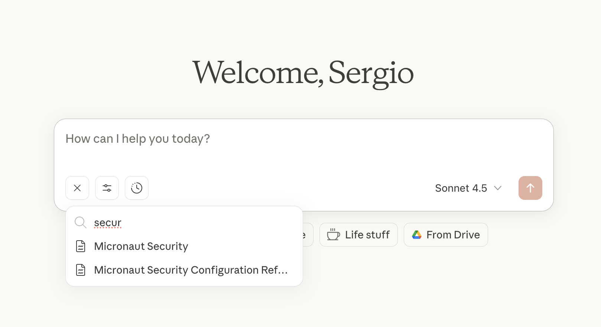
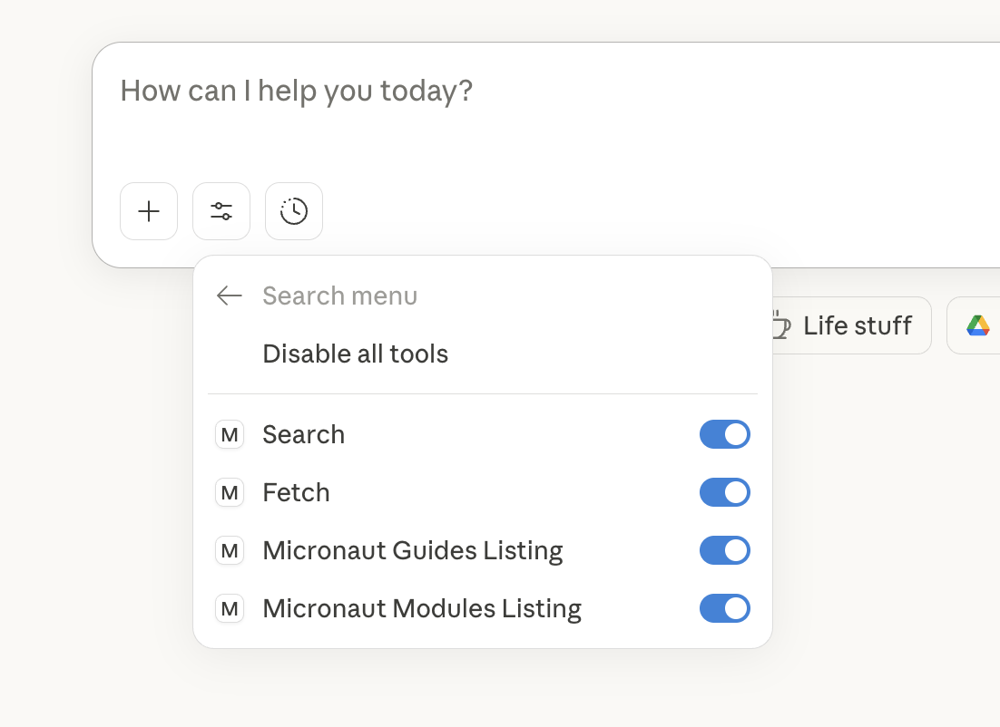
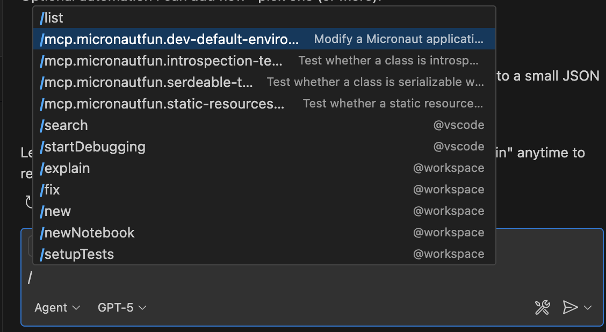

# Micronaut Fun

[https://micronaut.fun](https://micronaut.fun)

Micronaut Fun is a web application built with [Micronaut](https://micronaut.io/) and [OpenSearch](https://opensearch.org/). It provides a search engine for [Micronaut documentation](https://docs.micronaut.io) and [Micronaut Guides](https://guides.micronaut.io).

The application is deployed via [Kamal](https://kamal-deploy.org) to an [Oracle Cloud](https://cloud.oracle.com) compute instance.

## MCP Server

The application exposes an [MCP Server](https://modelcontextprotocol.io) at `https://micronaut.fun/mcp`.

You can install it with: 

- [Claude Destkop](/docs/claude-desktop.md)
- [Claude Code](/docs/claude-code.md)
- [VS Code](/docs/vs-code.md)
- [IntelliJ IDEA GitHub Copilot](/docs/idea-github-copilot.md)

### Documentation resources

You can add Micronaut Documentation resources to the context of your conversation: 



### Tools

You can use tools to search the Micronaut documentation and guides. 



### Prompts

You can use prompts to help you with your Micronaut day-to-day tasks:



## Local development 

To run the app locally, run `./gradlew run`. 

If you want to run the complete app, run opensearch via docker

```bash
docker run -d --name micronautfunopensearch -p 9200:9200 -p 9600:9600 -e "discovery.type=single-node" -e "plugins.security.disabled=true" -e "OPENSEARCH_INITIAL_ADMIN_PASSWORD=DummyPassword#1233" opensearchproject/opensearch:2.19.3
```

remove `micronaut.opensearch.enabled=false` from `src/main/resources/application-dev.properties` and run the app