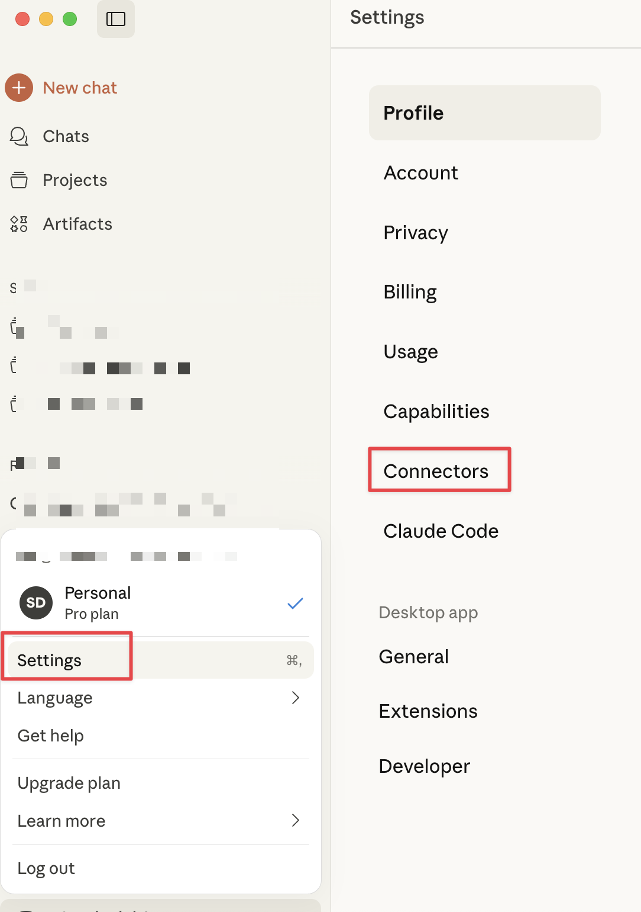

# Add Micronaut Fun MCP Server to Claude Desktop

To register an MCP Server in Claude Desktop, click on `Settings`, click the `Connectors`

Click `Add Custom Connector`, enter the Micronaut Fun MCP Server URL `https://micronaut.fun/mcp` and click `Add Connector`

