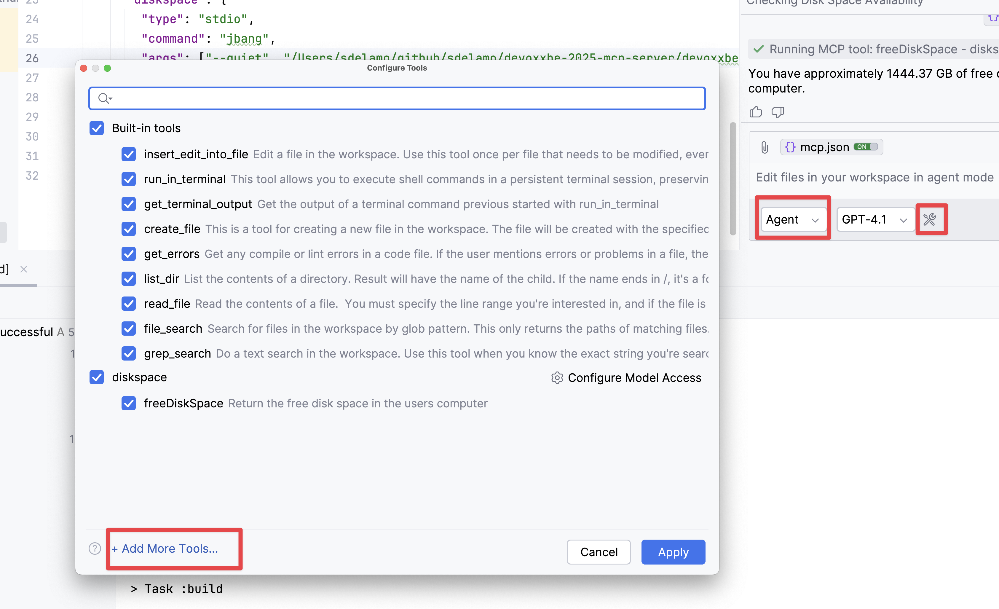

# Add an MCP Server to GitHub Copilot in IntelliJ IDEA

To register a MCP Server in GitHub Copilot for IntelliJ IDEA, change to `Agent` model, click the `Tools` icon and click `Add More Tools...`



Enter your MCP Server in the `mcp.json` configuration file. The following example shows an MCP Server packaged as a FAT jar which uses STDIO transport.

```json
{
  "servers": {
    "micronautfun": {
      "url": "https://micronaut.fun/mcp/"
    }
  }
}
```