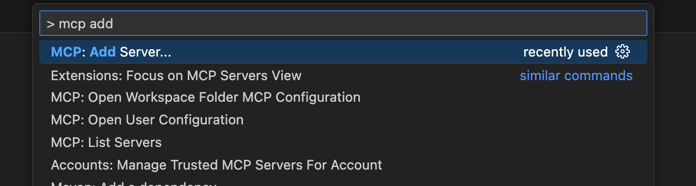
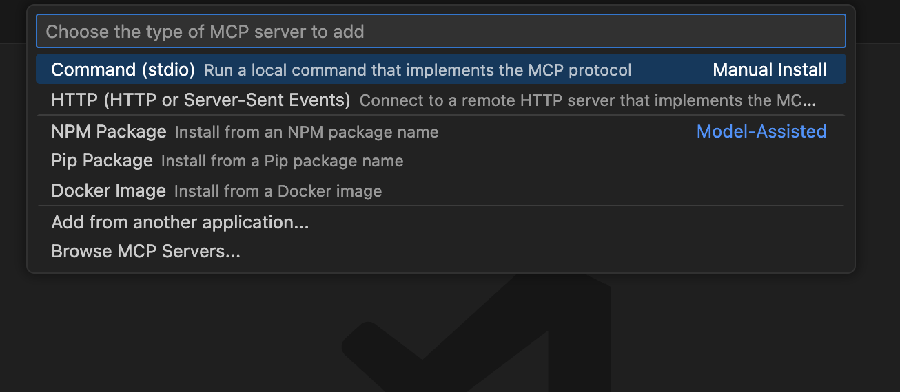
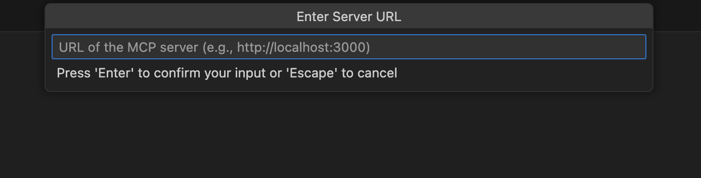
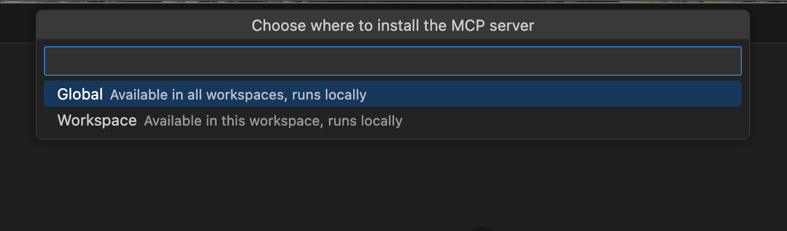
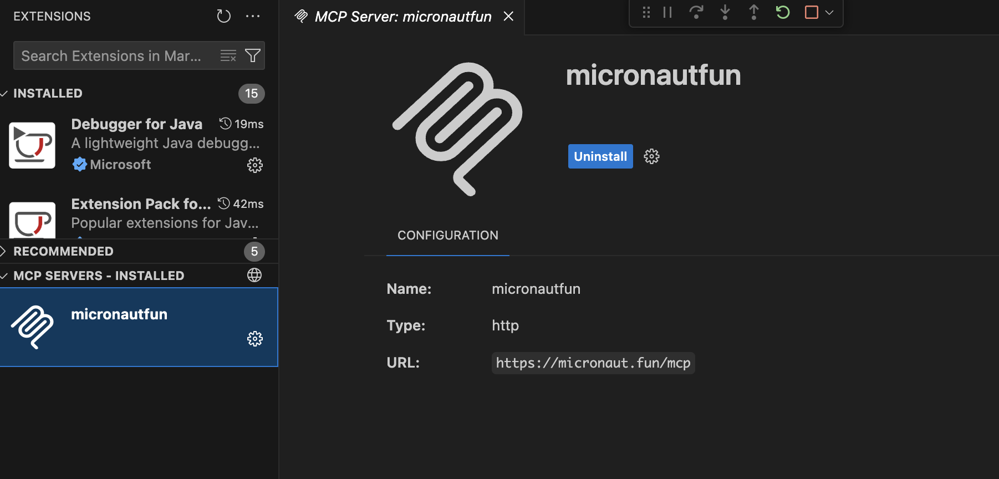

# Add an MCP Server to VS Code
To register a MCP Server in VS Code open the command palette with (CMD + Shift + P) and search for "Add MCP"

# [%title]

[%summary]



Select your MCP Server transport (STDIO or HTTP)



If HTTP, enter your MCP Server URL.



Select whether you want to install the MCP Server globally or for the current workspace only.



Enter your MCP Server in the `mcp.json` configuration file.

The following example shows an MCP Server which uses Streamable HTTP transport.

```json
{
  "servers": {
    "micronautfun": {
      "url": "https://micronaut.fun/mcp",
      "type": "http"
    }
  },
  "inputs": []
}
```

You should see your MCP listed as installed.

